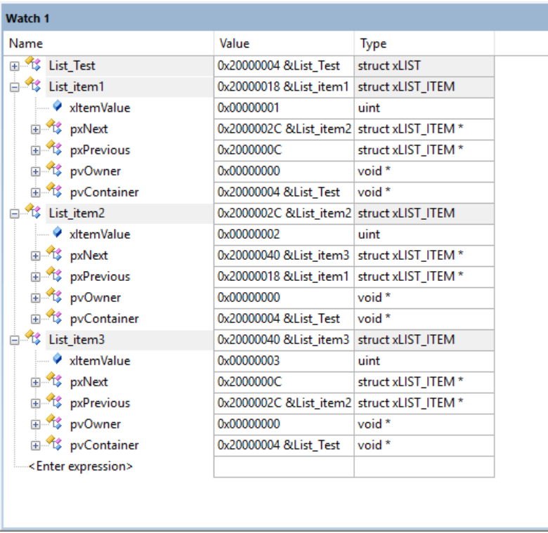

## Description

This lab is the first core module in my FreeRTOS rebuild journey. It implements the FreeRTOS-style doubly linked list.

FreeRTOS uses this list structure as the foundation for ready lists, delayed lists, event lists, and scheduler bookkeeping. The goal is not just to build a normal linked list, but to reproduce the behavior that later kernel modules depend on.

## What This Lab Implements

- `List_t`, the list object.
- `ListItem_t`, the normal list node.
- `MiniListItem_t`, the sentinel end marker.
- `vListInitialise()`.
- `vListInitialiseItem()`.
- `vListInsert()`.
- `vListInsertEnd()`.
- `uxListRemove()`.
- Common list macros for item value, owner, container, and head entry access.

## Main Idea

Each FreeRTOS list has an end marker item. This makes insertion and traversal simpler because the list always has a known boundary.

Sorted insertion is based on `xItemValue`:

```text
smaller xItemValue -> closer to the front
larger xItemValue  -> closer to the end
```

Each list item also stores:

```text
pvOwner      -> the object that owns this item
pvContainer  -> the list this item currently belongs to
```

These fields are important later because a scheduler can get from a list item back to the task TCB that owns it.

## Key Flow

List setup:

```text
vListInitialise()
  -> initialize xListEnd
  -> point xListEnd.pxNext to itself
  -> point xListEnd.pxPrevious to itself
  -> set uxNumberOfItems to 0
```

Item setup:

```text
vListInitialiseItem()
  -> clear pvContainer
```

Sorted insertion:

```text
vListInsert()
  -> find insertion point by xItemValue
  -> reconnect previous and next pointers
  -> set item pvContainer
  -> increase item count
```

Removal:

```text
uxListRemove()
  -> reconnect neighbor items
  -> clear item pvContainer
  -> decrease item count
```

## Test Scenario

`User/main.c` creates one list and three list items. The items are assigned values `1`, `2`, and `3`, then inserted in a different order.

The expected final order is:

```text
1 -> 2 -> 3
```

This confirms that `vListInsert()` correctly performs sorted insertion.

## Demo


