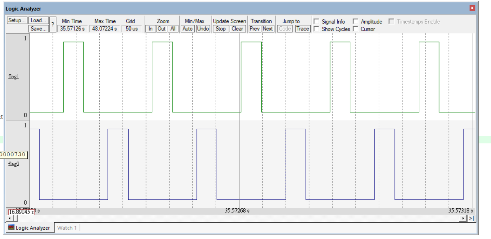

# Description

This lab continues from `Lab01-List-Core`. After implementing the FreeRTOS-style doubly linked list, this lab uses that list infrastructure to build the first minimal task system.

The goal of this lab is to understand how a task is represented, how a task is created with static memory, how a task can be linked into a ready list, and how the architecture-specific port layer prepares the CPU context needed to start and switch tasks.

This is not a complete FreeRTOS scheduler yet. It is a minimal cooperative context-switching demo for learning the core mechanism behind task creation and task switching on ARM Cortex-M3.

## What This Lab Adds After Lab01

Lab01 focused only on the generic list module:

- `List_t`
- `ListItem_t`
- `MiniListItem_t`
- list insertion and removal
- list owner/container tracking

Lab02 builds on top of that by adding:

- `TCB_t`, the task control block.
- Static task creation through `xTaskCreateStatic()`.
- Per-task stack buffers.
- Per-task list items through `xStateListItem`.
- Ready lists grouped by priority with `pxReadyTasksLists[]`.
- Initial task stack frame construction in the port layer.
- First task startup through SVC.
- Manual task switching through PendSV.
- Cooperative switching through `taskYIELD()`.

## Main Components

### TCB_t

`TCB_t` represents one task. It stores the information needed by the scheduler and the CPU port layer:

```c
typedef struct tskTackControlBlock {
    volatile StackType_t *pxTopOfStack;
    ListItem_t xStateListItem;
    StackType_t *pxStack;
    char pcTaskName[configMAX_TASK_NAME_LEN];
} tskTCB;
```

The most important fields are:

- `pxTopOfStack`: The saved stack pointer of the task. Context switching depends on this field.
- `xStateListItem`: The list item used to link the task into a ready list.
- `pxStack`: The stack memory assigned to the task.
- `pcTaskName`: The task name used for debugging.

### Ready Lists

The ready lists are declared as:

```c
List_t pxReadyTasksLists[configMAX_PRIORITIES];
```

This means each priority level owns one ready list. For example, if `configMAX_PRIORITIES` is 5, then the kernel has:

```text
pxReadyTasksLists[0]
pxReadyTasksLists[1]
pxReadyTasksLists[2]
pxReadyTasksLists[3]
pxReadyTasksLists[4]
```

In this lab, tasks are manually inserted into the ready lists from `User/main.c`.

## Task Creation Flow

Task creation starts from:

```c
xTaskCreateStatic(...)
```

Because this lab uses static allocation, the user provides both the task stack and the TCB memory:

```c
StackType_t Task1Stack[TASK1_STACK_SIZE];
TCB_t Task1TCB;
```

The creation flow is:

1. `xTaskCreateStatic()` checks whether the provided stack buffer and TCB buffer are valid.
2. The provided TCB buffer is used as the new task's `TCB_t`.
3. The provided stack buffer is assigned to `pxNewTCB->pxStack`.
4. `prvInitialiseNewTask()` initializes the task metadata.
5. The task name is copied into the TCB.
6. The task's `xStateListItem` is initialized.
7. The list item's owner is set to the task's TCB.
8. `pxPortInitialiseStack()` builds the initial CPU stack frame.
9. The returned stack pointer is stored in `pxNewTCB->pxTopOfStack`.
10. The created task handle is returned to the caller.

At this stage, initializing `xStateListItem` only prepares the task to be inserted into a list. The actual ready-list insertion is done separately with `vListInsertEnd()`.

## Relationship Between task.c and port.c

`task.c` owns the kernel-level task logic:

- Creating a TCB.
- Assigning stack memory.
- Initializing task list items.
- Starting the scheduler.
- Selecting the next task in `vTaskSwitchContext()`.

`port.c` owns the ARM Cortex-M3-specific CPU logic:

- Building the initial stack frame for a task.
- Starting the first task through SVC.
- Saving the current task context in PendSV.
- Restoring the next task context in PendSV.

The boundary between these two layers is declared in `portable.h`:

```c
StackType_t *pxPortInitialiseStack(...);
BaseType_t xPortStartScheduler(void);
```

This keeps the generic task logic separate from CPU-specific assembly code.

## Context Switch Flow

The current lab performs cooperative context switching:

```text
Task1
  -> taskYIELD()
  -> portYIELD()
  -> PendSV
  -> save Task1 context
  -> vTaskSwitchContext()
  -> restore Task2 context
  -> Task2
```

The first task is started through SVC:

```text
vTaskStartScheduler()
  -> xPortStartScheduler()
  -> prvStartFirstTask()
  -> svc 0
  -> vPortSVCHandler()
  -> restore first task context
```

After the first task is running, later switches are handled by PendSV.

## Test Scenario

`User/main.c` creates two tasks:

- `Task1_Entry()`: toggles `flag1`
- `Task2_Entry()`: toggles `flag2`

Both tasks call `taskYIELD()` so the PendSV handler can switch between them.

The expected behavior in Keil Logic Analyzer is that `flag1` and `flag2` toggle alternately, showing that the CPU context is being switched between the two task stacks.

## Current Limitations

This lab intentionally keeps the scheduler simple. It does not yet implement:

- Automatic task insertion into ready lists.
- Priority-based task selection from `pxReadyTasksLists[]`.
- SysTick-based time slicing.
- Blocking delay lists.
- Idle task creation.
- Full FreeRTOS-compatible scheduling behavior.

The purpose of this lab is to understand the essential mechanism:

```text
TCB + stack frame + SVC startup + PendSV context switch
```
### Logic Analyzer Demo

The waveform shows `flag1` and `flag2` toggling in turn. This confirms that the two tasks are switching execution through `taskYIELD()` and the PendSV context switch handler.


