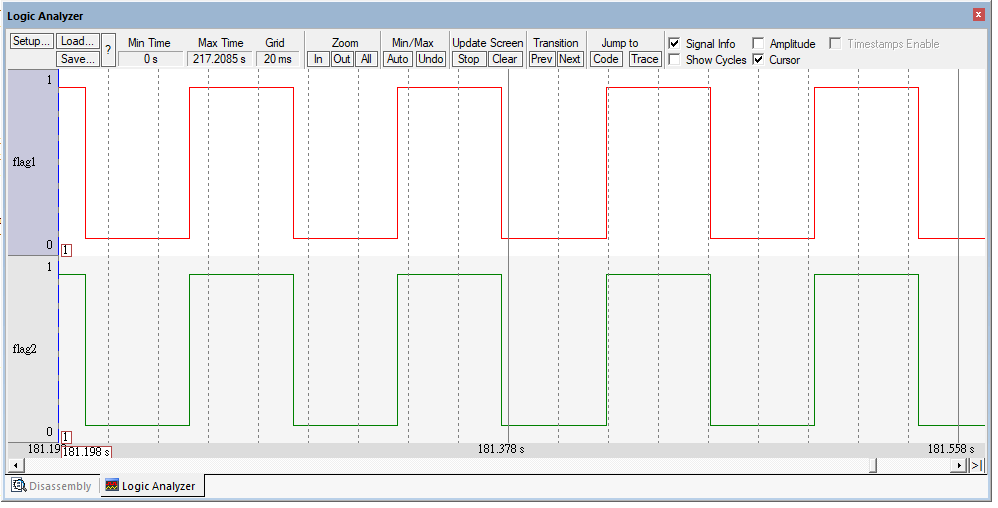

## Description

This lab continues from `Lab03-Critical-Section-Core`. Lab03 added `BASEPRI`-based critical sections. Lab04 adds the first time-based scheduling behavior.

Tasks can now call `vTaskDelay()` to stop running for a number of ticks. SysTick periodically decreases each task's delay counter, and the scheduler skips tasks that are still delayed. When no user task is ready, the idle task runs.

This is still a simplified FreeRTOS scheduler. It uses a delay counter inside each TCB instead of a real delayed task list.

## What This Lab Adds After Lab03

- Idle task creation.
- Application-provided idle task memory.
- `xTicksToDelay` inside each TCB.
- `vTaskDelay()`.
- SysTick timer setup.
- SysTick handler for tick updates.
- Scheduler logic that skips delayed tasks.
- PendSV requests from both `vTaskDelay()` and SysTick.

The main new functions are:

```c
void vTaskDelay( const TickType_t xTicksToDelay );
void xTaskIncrementTick( void );
void vApplicationGetIdleTaskMemory( TCB_t **pxIdleTaskTCBBuffer,
                                    StackType_t **pxIdleTaskStackBuffer,
                                    uint32_t *ulIdleTaskStackSize );
```

## Main Idea

Each task now has a delay counter:

```c
TickType_t xTicksToDelay;
```

The scheduler treats it like this:

```text
xTicksToDelay == 0  -> task is ready
xTicksToDelay > 0   -> task is delayed
```

When a task calls:

```c
vTaskDelay( 2 );
```

the kernel stores `2` in the current task's TCB and triggers PendSV. SysTick later counts that value back down to `0`.

## Idle Task

The idle task is created during `vTaskStartScheduler()`. Its stack and TCB are provided by the application:

```c
StackType_t IdleTaskStack[ configMINIMAL_STACK_SIZE ];
TCB_t IdleTaskTCB;
```

The idle task itself only loops:

```c
static portTASK_FUNCTION( prvIdleTask, pvParameters )
{
    ( void ) pvParameters;
    for( ;; );
}
```

Its purpose in this lab is simple: run when Task1 and Task2 are both delayed.

## Key Flow

Scheduler startup:

```text
main()
  -> create Task1 and Task2
  -> vTaskStartScheduler()
      -> get idle task memory
      -> create idle task
      -> xPortStartScheduler()
      -> SVC starts Task1
```

Task delay:

```text
Task1_Entry() or Task2_Entry()
  -> vTaskDelay( 2 )
      -> set current TCB xTicksToDelay
      -> taskYIELD()
      -> PendSV
      -> vTaskSwitchContext()
```

SysTick update:

```text
SysTick_Handler
  -> xPortSysTickHandler()
      -> xTaskIncrementTick()
          -> decrease xTicksToDelay
          -> portYIELD()
      -> PendSV
      -> vTaskSwitchContext()
```

Context switch decision:

```text
If Task1 is delayed, try Task2.
If Task2 is delayed, try Task1.
If both user tasks are delayed, run IdleTask.
If a delayed task reaches 0, it can run again.
```

## Current Limitations

This lab does not yet implement real FreeRTOS delayed lists, priority selection across all ready lists, or full idle task behavior. The purpose is to connect four ideas:

```text
vTaskDelay() + SysTick + PendSV + IdleTask
```

This turns the previous manual task switch demo into a small time-based scheduler.

## Demo


